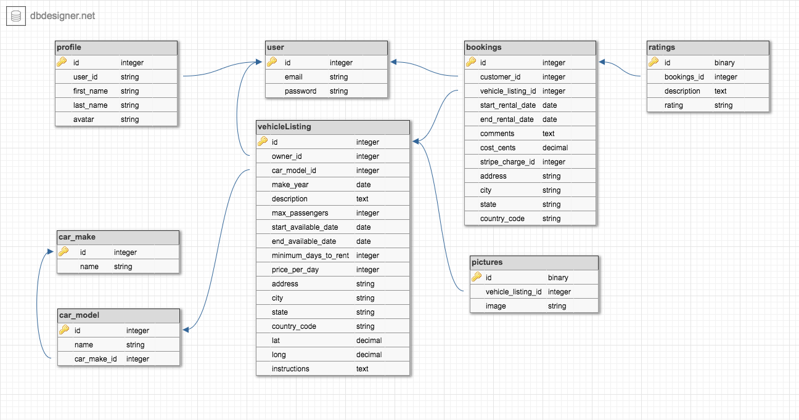
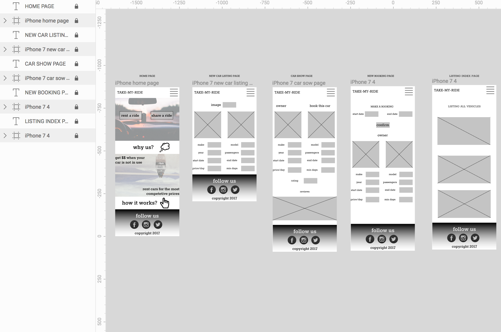
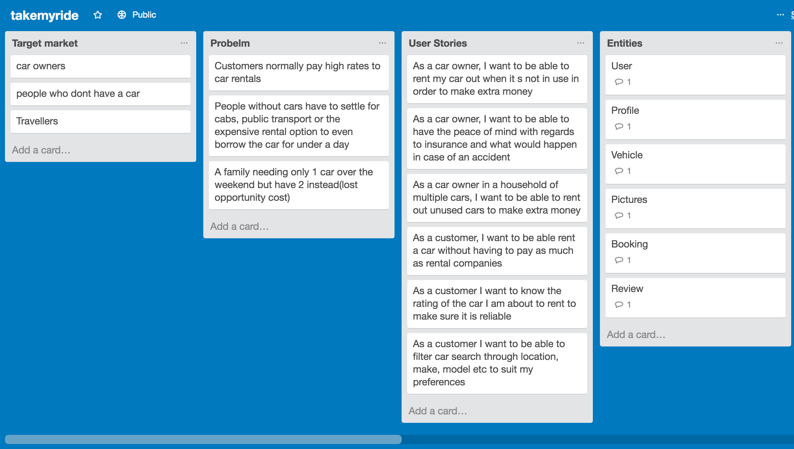
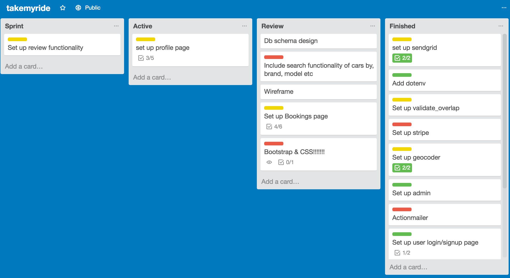
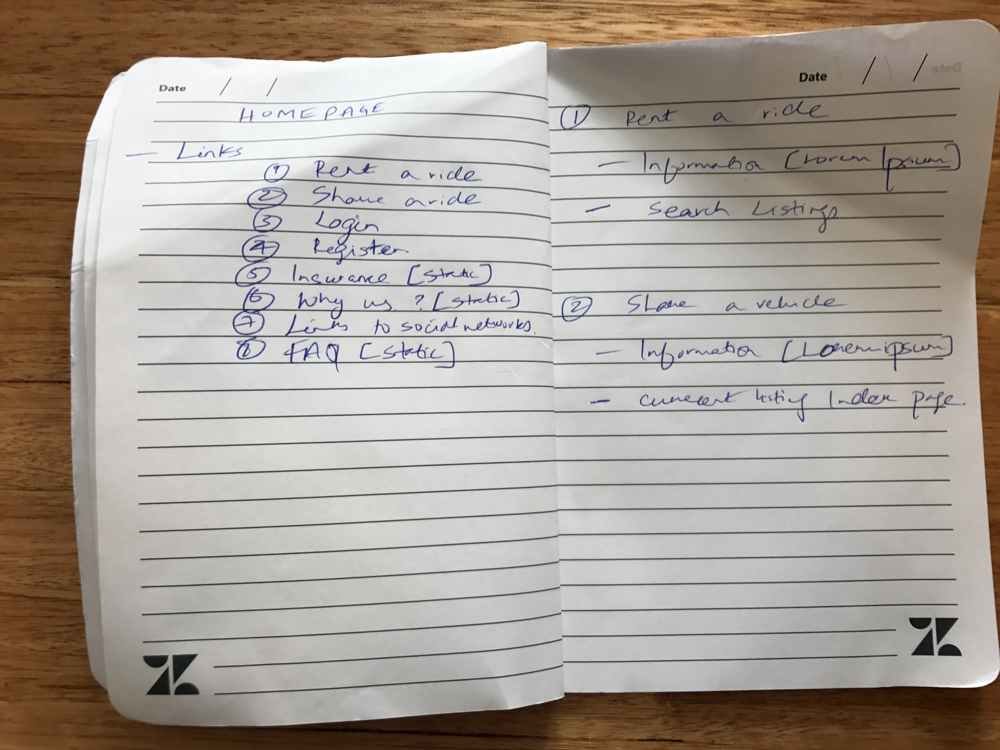
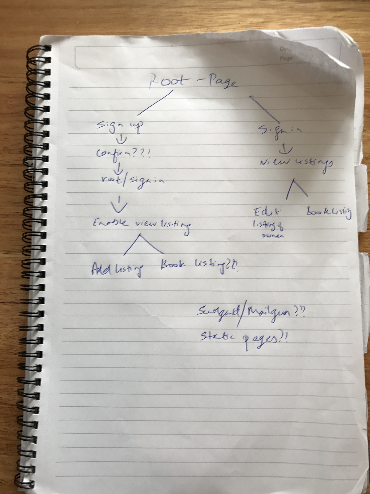
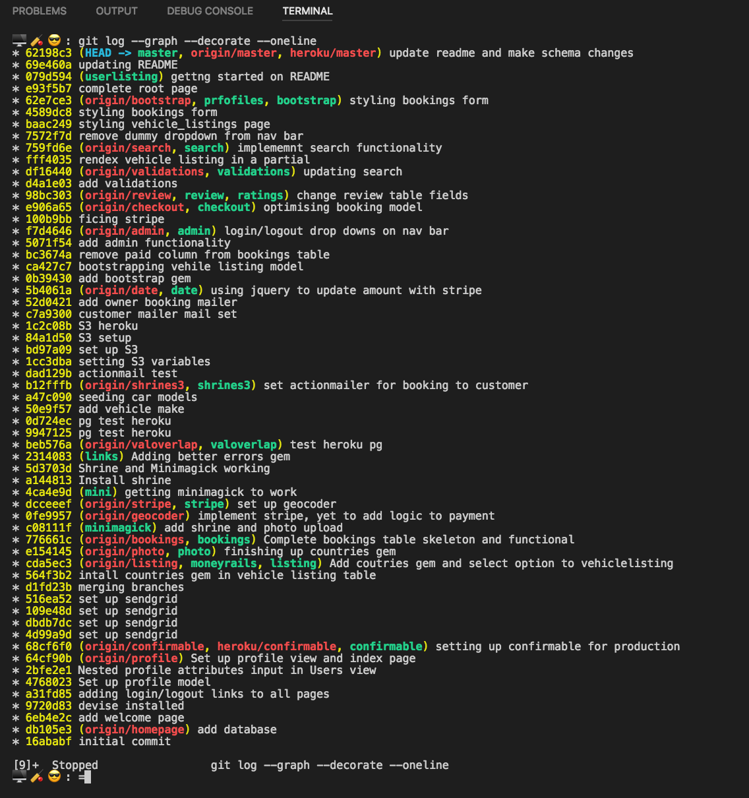

# takemyride

Coder Factory Academy(M2) - Melbourne, Term 2 Project

#### View and interact with the live app at [https://takemyride-whiterabbit.herokuapp.com/](https://takemyride-whiterabbit.herokuapp.com/)

## A quick project summary

#### An online platform where car sharing is made possible
- Enables car owners to list their cars for short term lease
- Alows potential customers who want to hire a car to directly connect with car owners 

#### To use the application
- Visit the live link at the top of this README
- If you would like admin access please use the uername: vigneshnatarajan@icloud.com password: password
#### Alternatively
- You can also clone the repositroy and setup locally
- run rails db:create
- run rails db:migrate
- run rails db:seed
- create a ENV file in the root folder and load your keys for Sendgrid, stripe and Amazon s3 bucket
- Please also incude --> EMAIL=donotreply@example.com in your ENV file
- run rails s
- navigate to localhost:3000 to test the project
- If you would like admin access, please enter the rails console and toggle the desired users admin status to true

### Assignment Criteria 📑
✔️ = Done 😊 | ❌ = Not Done 😞 | ❎ = Kinda Done 😑

#### DESIGN DOCUMENTATION
##### Demonstrate your ability to break down the problem and design a solution
1. ✔️ One page summary of your application including problem definition, solution.
2. ✔️ A workflow diagram of the user journey/s.
3. ✔️ Wireframes for at least 5 screens.
4. ✔️ User stories for the whole application.
5. ✔️ Entity Relationship Diagram (ERD).
6. ✔️ Project plan and estimation.

#### TOOLS AND METHODOLOGIES
1. ✔️ Trello or similar project management tool to be used to track progress of build.
2. ❎ Show evidence of Slack conversations or use of other communication tools(not sure how I can prove this but did a whole lot of verbal communication).
3. ✔️ Code review. Demonstrate that you have had your code reviewed by other students and that you have provided a code review for others(Jaime, Teck and George helped me out a quite a bit, and others as well. I have also given my input to a few students and gone through their code).
4. ✔️ Github. Demonstrate use of frequent commits, pull requests, documentation(Plenty of commit and branches).
5. ✔️ Use Agile development methodologies(Trello is great!!!).
6. ❌ Provide evidence you have used code quality tools (eg. Traceroute, Bullet, Brakeman, Rails Best Practices tool, RuboCop, RubyCritic, CodeClimate)(Sorry, ran out of time to implement any of this, but will do so as an improvement).

#### RAILS APPLICATION CODE
1. ✔️ Create your application using Ruby on Rails.
2. ✔️ Demonstrate knowledge of Rails conventions.
3. ✔️ Use postgresql database in development.
4. ✔️ Use an API (eg. Omniauth, Geocoding, Maps, other..).
5. ✔️ Use appropriate gems
6. ✔️ Use environmental variables to protect API keys etc.
7. ✔️ Implement a payment system for your product.
8. ✔️ Your app must send transactional emails (eg. using Mailgun)
9. ️❎  Your app should have an internal user messaging system. (not, sure if vehicle owner and customer able to share emails counts??)
10. ✔️ Your app will have some type of searching, sorting and or filtering capability.
11. ✔️ Your app will have some type of file uploading capability (eg. images).
12. ✔️ Your app will have authentication (eg. Devise, must have full functionality in place).
13. ✔️ Your app will have authorisation (users have restrictions on what they can see and edit).
14. ❎ Your app will have an admin dashboard for the admin user to administrate the site. (Can have admin access after toggling boolean from console)
15. ✔️ Document your application with a README that explains how to setup, configure and use your application.

#### DEPLOYED APPLICATION

1. ✔️ Your application is to be deployed to Heroku / AWS.

## Database schema - ERD 📊

## Mockups / Wireframes 🖼
[Hosted on Figma](https://www.figma.com/file/VhdyvsgAHD8SV6dDAEMEr9xE/takemyride)

## Trello 😏
[Trello - takemyride - Ruby on Rails - CoderFactoryAcademy](https://trello.com/b/0h5xuf95/takemyride)

## Initial workflow ideas 😏

## Gems used

1. gem 'bootstrap-sass', '~> 3.3.5'- for bootstrap
2. gem 'devise' - for user authentication
3. gem 'dotenv-rails', groups: [:development, :test] - to store API keys
4. gem 'countries' - to countries list
5. gem 'stripe' - Payment integration
6. gem 'validates_overlap' - to prevent double bookings
7. gem 'shrine', '~> 2.6', '>= 2.6.1' - Image uploading
8. gem 'geocoder' - for google maps API
9. gem "image_processing" - for image processing
10. gem "mini_magick", ">= 4.3.5" - for image resizing
11. gem "aws-sdk", "~> 2.1" - to handle file uploads on the s3 bucket
12. gem 'will_paginate', '3.1.5' - to create page breaks
13. gem 'jquery-ui-rails'(added by Ruegen) - for bookings page refresh

# How I went about setting up the app

## 1. Set up tables:
- Coded in all my table data from the ERD I had prepared earlier.
- Was smooth sailing for most of it, but I had to make a couple of minor changes along the way.
- Decided to seed in car makes and models and this proved quite helpful.

## 2. Set up devise, user and profile :

- This was a pretty straightforward task.
- Only issue I has was my decison to nest the profile table attributes in the user model
- This proved to be costly towards the end of the project as I have to completely re think the profile show page. Someting I am working on right now.

## 3. Set up sendgrid

- This took a while to set up.
- Got a proper understanding the ENV variables and how to set them up.

## 4. Set up vehicle listing table:

- Definetely spent a lot of time on this.
- Used scaffold to generate MVC.
- Started my gem installations here with geocoder and countries.

## 5. Set up photos table:

- Had a hard time setting up shrine and imagemagick.
- Found it a bit tricky because I had to display my photos in another model.
- Reaached out to Janko(creator of Shrine) and he helped promptly!! 

## 6. Set up Booking

- By far the hardet part of the project.
- Used scaffold to set up MVC.
- Hardest part was getting payments working and getting info passed in from vehicle listing table.
- Definitely a learning experience as I really gained a solid understandong of how rails works by this point.
- Had to install validates overlap gem to prevent double booking.
- Also included some custom validations with regards to dates that can be chosen and found it pretty straghtforward.

## 7. Set up Actionmailer

- Surprisingly easy as I thought this would be way out my depth.
- Spent far less time setting up this than I anticipated.

## 8. Set up S3 bucket
- Again, took my time setting this up as there was a lot of different elements involved.
- Heroku kept giving me errors but finally worked after about half a days work.

## 9. Set up stripe

- Setting up stripe as a whole was very challenging mainly because I had almost no time left. 
- I assumed this would be easy enough but I hit a major roadblock, as customers updated dates would not reflect on stripe create action.
- Had to resort to getting help from Ruegen with some jquery.(However, I have now learnt a method to do this without jquery and I am currently working on that)

#### To have live price updates on bookings new page:(with the help of Ruegen)
Problem: Don't yet have JavaScript skills to create seamless payment through one action. 
Solution: have a paid bool field that produces a pay button on the booking :show page which will only show if paid is false.
Booking is not final until paid is true

We do not do this because we wanted to use jquery, jQuery UI and a special stripe amount which needed to be variable - page info:
https://stripe.com/docs/recipes/variable-amount-checkout

1. We added a button
2. We did some JavaScript & jQuery to find out the days
3. We updated a variable amount * price
4. We put that amount in the stripe JavaScript action

## 10. Adding bootstrap

- I wish I had more time to style, but just added some basic classes to make the app look presentable
- This being my first proper experience with bootstrap, I really could see how quickly pages can be styled as opposed to the term 1 project of using vanilla CSS.

## GIT HISTORY

## To Do 🔥🔥🔥
- Get the bookings side of the app have a much better UI and replace the existing javascript with just rails code(I am doing this right now).
- Explore and learn how to use code quality tools.
- Properly set up the profile model. ✔️ ==> This issue ha ow been fixed.
- Set up a proper internal messaging system.
- Complete the review functionality.
- Expand on the current search functionality.
- Add static pages(about, why us?, how it works? etc).

# A few words I would like to say
- This has by far been one of the hardest 2 weeks of my life and I have worked against some pretty stringent deadlines in the past. The only difference here was that I was learning the language as I was preparing the project. 
- Never the less, it has been a great experience and I dont want to stop here. I will continue to work on this project and hopefully will get to learn more.
- The past 2 weeks has really pushed my mental capabalities, and even though I questioned myself on a couple of occasions I am so glad that I made it through(albeit I feel i can make it much better).

# A big thank you
- To Patrick, Ruegen and John - our wonderful tutors, for putting up with my annoying questions all day everyday!!
- To all my class mates who have supported me through this project and the course overall as well. It was great that we all came together and helped each other out. Special mentions to Jaime, George and Teck for their valuable input.

                                             ** THE END **
